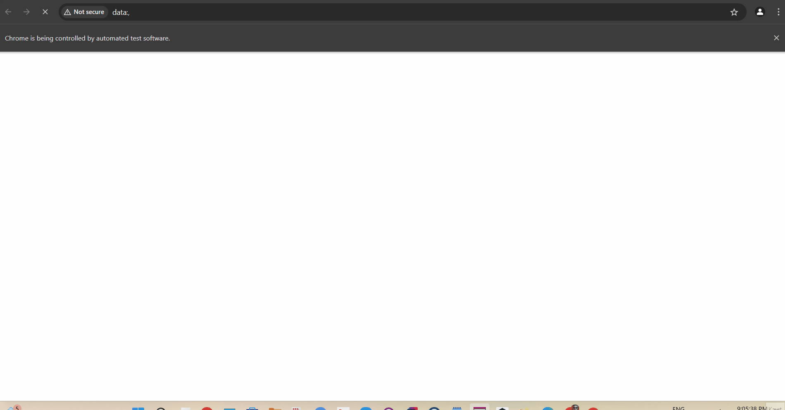
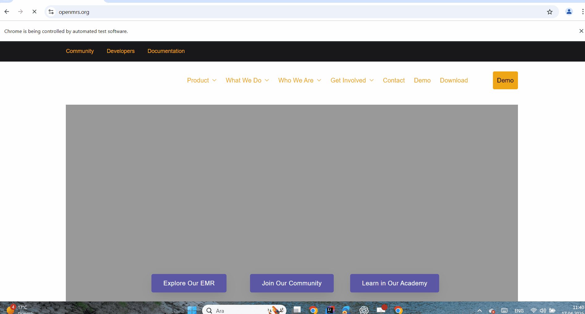
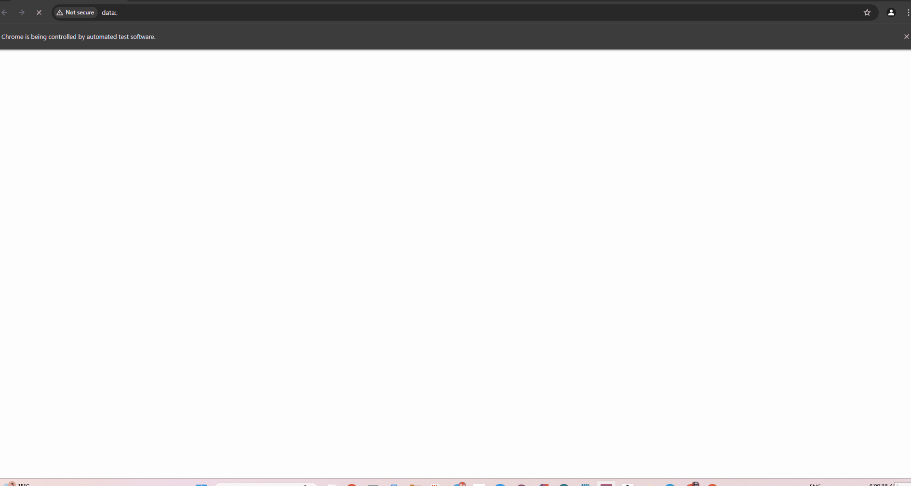
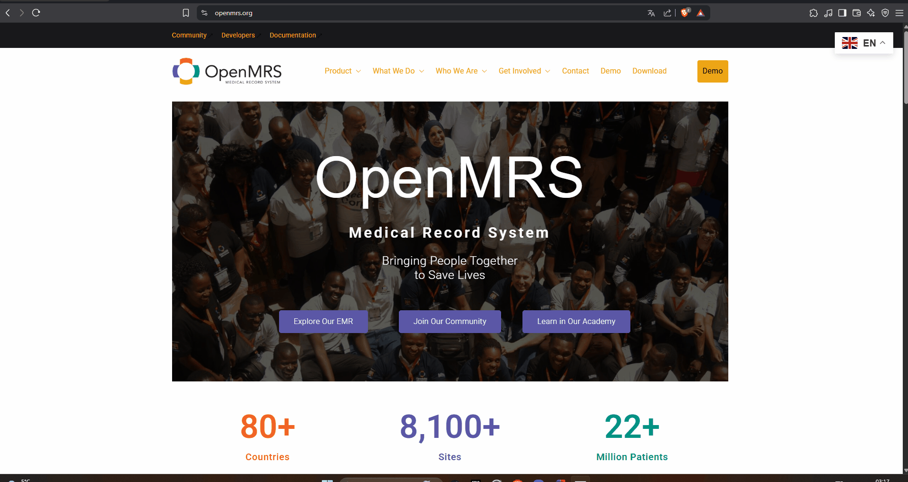

# OpenMRS Test Automation Project – with TestNG 

## 📌 Table of Contents
- [Project Description](#project-description)
- [Project Structure](#project-structure)
- [Project Structure Explanation](#project-structure-explanation)
- [User Stories and Test Scenarios](#user-stories-and-test-scenarios)
- [Test Coverage Table](#test-coverage-table)
- [Tools and Technologies](#tools-and-technologies)
- [Project Team](#project-team)
- [GitHub Repository](#github-repository)
- [Project Team GitHub](#project-team-github)
- [License](#license)

---

## 📝 Project Description

This project automates test scenarios for the **OpenMRS Demo System**, an open-source medical record platform.  
The test scenarios are implemented using **TestNG**, **Selenium WebDriver**, and follow the **Page Object Model (POM)** structure.  
Test executions are configured through the `testng.xml` file.

📅 Features:
- Modular POM design
- Test grouping and execution via `testng.xml`
- Data-driven testing using `@DataProvider`
- Parallel and cross-browser test support

🔗 [OpenMRS Demo](https://openmrs.org/)  

---

## 🏗️🚛  Project Structure

```plaintext
OpenMRSProject/
│
├── src/
│   ├── OpenMRS/
│   │    │ 
│   │    ├── base/             # BaseDriver and core structure
│   │    ├── elements/         # Page Object classes (POM)
│   │    ├── methods/          # User actions
│   │    └── tests/            # TestNG test scenarios
│   │        └─XML/            # TestNG configuration files
│   │
│   └── utility/               # Helper classes (MyFunc, etc.)
│
├── test-output/               # TestNG output reports
├── tests_gif/                 # Test GIFs
│ 
└── README.md                  # Project documentation

```
---
## 📖 Project Structure Explanation
- **src/OpenMRS/base/**: Contains the `BaseDriver` class and core structure.
- **src/OpenMRS/elements/**: Contains Page Object classes (POM) for each page.
- **src/OpenMRS/methods/**: Contains methods for user actions.
- **src/OpenMRS/tests/**: Contains TestNG test scenarios.
- **src/OpenMRS/tests/XML/**: Contains TestNG configuration files.
- **src/OpenMRS/utility/**: Contains helper classes like `MyFunc`, etc.
- **test-output/**: Contains TestNG output reports.
- **tests_gif/**: Contains GIFs demonstrating test scenarios.
- **README.md**: Contains project documentation.
---

## 🧑‍💻 User Stories and Test Scenarios

### **1️⃣ US_401 - Login test with invalid user data**
📌 As a user, I want to see error messages for failed login attempts to enhance system security.

✅ Expected: Location selection and invalid credential errors are displayed appropriately.

✅ Actual: Relevant warnings such as "You must choose a location!" and "Invalid username/password. Please try again." appeared.


### **2️⃣ US_402 Login test with valid user data**
📌 As a user, I want to log into the system with valid credentials to access system features.

✅ Expected: User logs in successfully after selecting a location.

✅ Actual: Successful login occurred with correct username, password, and location.


### **3️⃣ US_403 - Logout**
📌 As a user, I want to log out of the system to protect sensitive data.

✅ Expected: Clicking "Logout" redirects to the login page.

✅ Actual: The session ended successfully, and the user was logged out.



### **4️⃣ US_404 - Patient registration**
📌 As a user, I want to be able to register a patient by entering their information into the system.

✅ Expected: User registers a new patient with demographic/contact/relationship info.

✅ Actual: Patient appeared in the system after successful registration.


### **5️⃣ US_405 - Access account settings**
📌 As a user, I want to have an icon or link on the homepage that leads to my account settings.

✅ Expected: “My Account” opens with settings options like “Change Password.”

✅ Actual: User accessed and interacted with account settings.



### **6️⃣ US_406 - Patient search in list**
📌 As a doctor, I want to search for a specific patient to access their information.

✅ Expected: Valid searches return patient data; invalid searches show “No match.”

✅ Actual: Both positive and negative test cases passed.


### **7️⃣ US_407 - Patient deletion**
📌 As a doctor, I want to be able to delete a patient from the system.

✅ Expected: Doctor deletes patient record with a valid reason.

✅ Actual: Patient data successfully removed from the system.


### **8️⃣ US_408 - List all patients**
📌 As a doctor, I want to list all patients so that I can plan more effectively.

✅ Expected: The number of rows in the patient table matches the summary below.

✅ Actual: Patient list and summary count were consistent.



---

### **9️⃣ US_409 - Merge patient records**
📌 As a doctor, I want to merge duplicate patient records to manage information better.

✅ Expected: Records merged after selecting IDs and confirming.

✅ Actual: Patient records merged and displayed correctly.



---

### **🔟 US_410 - Timezone error on appointment**
📌 As a user, I want to see an error message when scheduling an appointment with incorrect system timezone.

✅ Expected: Error appears if timezone is not GMT+0.

✅ Actual: Application blocked scheduling until the timezone was corrected.


---

## 📊 **Test Coverage Table**

| Test Scenario                              | Status     | Priority |
|--------------------------------------------|------------|----------|
| US_401 - Login errors                      | ✅ Passed  | High     |
| US_402 - Successful login                  | ✅ Passed  | High     |
| US_403 - Logout                            | ✅ Passed  | High     |
| US_404 - Patient registration              | ✅ Passed  | Medium   |
| US_405 - My account settings               | ✅ Passed  | Low      |
| US_406 - Patient search                    | ✅ Passed  | High     |
| US_407 - Patient deletion                  | ✅ Passed  | High     |
| US_408 - List all patients                 | ✅ Passed  | Medium   |
| US_409 - Merge patient records             | ✅ Passed  | Medium   |
| US_410 - Timezone error during appointment | ✅ Passed  | Low      |

---

## 🚀 Tools and Technologies

| Tool / Technology       | Description                            |
|-------------------------|----------------------------------------|
| **Java**                | Programming language                   |
| **Selenium WebDriver**  | Web automation framework               |
| **TestNG**              | Testing framework                      |
| **TestNG XML**          | Manages test configurations and groups |
| **Maven**               | Dependency management and compilation operations in the project        |
| **Page Object Model**   | Reusable and maintainable test design  |
| **Git / GitHub**        | Version control                        |

---
## 📚 Required Libraries

To ensure the project runs correctly, the following libraries must be added to the project:

- Selenium
- TestNG
- Apache Commons IO
- SLF4J NOP

---
## 👨‍💻 Project Team

| Name                 | Role                                | User Story             |
|----------------------|--------------------------------------|------------------------|
| **Nuri Ozturk**      | Project Lead - QA Automation Eng.   | US_409                 |
| **Zafer Ataklı**     | QA Automation Engineer              | US_401, US_402, US_403 |
| **Tugba Kilic**      | QA Automation Engineer              | US_405                 |
| **Rıfat Batır**      | QA Automation Engineer              | US_404, US_407         |
| **Azim Korkmaz**     | QA Automation Engineer              | US_408                 |
| **Yigit Cam**        | QA Automation Engineer              | US_406                 |
| **Mert Can Özdemir** | QA Automation Engineer              | US_410                 |

> Note: This is a collaborative QA training project.

---

## 🔗 GitHub Repository

📂 [OpenMRS TestNG Automation Repository](hhttps://github.com/NuriOzturk/OpenMRS)

---

## 👨‍💻 Project Team GitHub

- **[Zafer Ataklı](https://github.com/zaferatakli)**
- **[Tugba Kılıç](https://github.com/TugbaKilic33)**
- **[Yiğit Çam](https://github.com/Yigit-Cam)**
- **[Rıfat Batır](https://github.com/rftbtr)**
- **[Azim Korkmaz](https://github.com/AzimKorkmaz)**
- **[Nuri Öztürk](https://github.com/NuriOzturk)**
- **[Mert Can Özdemir](https://github.com/lioncarnes)**

---
## Source

This project is based on the open source software [OpenMRS](https://github.com/openmrs).
For more information about OpenMRS: [https://openmrs.org](https://openmrs.org)

---

## 📝 License

This project incorporates code from the OpenMRS project: https://github.com/openmrs
